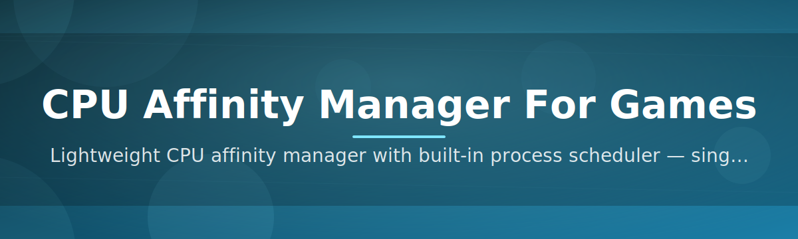

# 🎮 cpu-affinity-manager ⚡

  

*Pin your games to the cores that matter — squeeze out smoother frame times without touching a single registry key.*

  

## 🧠 Overview

**cpu-affinity-manager** is a lightweight Windows utility built for one very specific job: telling your games exactly which CPU cores they're allowed to use, and doing it automatically every time they launch. Modern processors ship with a jungle of core types — performance cores, efficiency cores, cache-clustered chiplets — and the Windows scheduler doesn't always make the smartest call about where your game engine's main thread should live. This tool hands that decision back to you, in a friendly UI instead of a Task Manager right-click ritual you have to repeat on every reboot.

The project exists because CPU affinity tuning for games has historically been a manual, forgettable chore. You'd open Task Manager, find the process, set affinity, and lose it all the second you closed the game. **cpu-affinity-manager** turns that one-off trick into a persistent, rule-based system: define a profile once for your favorite title, and the affinity mask is reapplied automatically on every future launch — silently, in the background, with zero extra clicks.

It's built for competitive players chasing consistent frame pacing on hybrid architectures, streamers who need spare cores reserved for encoding software, and tinkerers who just enjoy having granular control over their own hardware. No telemetry, no background bloat — just a focused tool that watches for game processes and applies the affinity rules you've defined.

---

## 🚀 What Makes It Shine

**Auto-Reapply Profiles** — Set an affinity mask for a game once, and it sticks forever. Every launch, every patch, every reboot — the rule reapplies itself without you lifting a finger.

**P-Core / E-Core Awareness** — On hybrid Intel and AMD chips, the manager detects performance versus efficiency cores and lets you target the right cluster instead of guessing from a raw bitmask.

**Process Watchdog** — A lightweight background listener detects when your target executable spawns and applies the affinity rule within milliseconds, even if the game relaunches itself mid-session.

**Per-Game Profile Library** — Build a personal catalog of titles, each with its own core mask, priority class, and optional notes — swap between them instantly.

**Priority Class Bundling** — Pair your affinity mask with a Windows process priority (High, Above Normal, etc.) so the two settings travel together as one profile.

**One-Click Mask Presets** — Quickly apply common patterns like "all performance cores," "leave two cores free," or "mirror last session" without manually toggling individual boxes.

**Portable, Zero-Install Footprint** — A single executable, no installer wizard, no services registered — just download and run.

**Session Logging** — A rolling log records every affinity change so you can confirm the tool did what you expected, or roll back a mistake.

> [!TIP]
> Pair a CPU affinity profile with a custom priority class for the biggest improvement in 1% and 0.1% low frame times on CPU-bound titles.

---

## 🏁 How To Get Started

> [!NOTE]
> This is a portable Windows tool — there's no traditional setup wizard involved.

1. **Visit the landing page** using the download button above and grab the latest build.

2. **Extract** the archive anywhere you like — your Desktop, a tools folder, a USB stick, it doesn't matter.

3. **Run the executable.** No admin rights are required for most games, though some protected processes may prompt for elevation.

4. **Create your first profile**, point it at a game executable, choose your core mask, and hit Save. The tool takes it from there.

---

## 🖥️ System Requirements

| Requirement | Details |
|---|---|
| OS | Windows 10 (64-bit) or Windows 11 |
| Dependencies | None — fully standalone |
| Disk space | Under 20 MB |
| Permissions | Standard user; admin only for protected processes |
| CPU | Any multi-core x86/x64 processor (hybrid-aware on Intel 12th gen+ and AMD equivalents) |

  

---

## ⚙️ How It Works

The core loop behind **cpu-affinity-manager** is intentionally simple, which is exactly why it's reliable:

1. **You define a profile** — an executable name paired with a desired core mask and priority class.

2. **A background watchdog** polls running processes at a lightweight interval, scanning for matches against your saved profiles.

3. **On match, the affinity mask is applied** via the Windows process API the instant the game's process is fully initialized.

4. **The change is logged** so you have a transparent history of every adjustment made on your behalf.

5. **The rule persists** — close the game, relaunch it next week, and the same mask applies automatically.

> [!IMPORTANT]
> Affinity changes are applied per-process and are not permanent OS-level settings — they only take effect while the watchdog is running.

---

## 🩹 Troubleshooting

<strong>My affinity mask isn't sticking after a game update.</strong>

Some updates rename the executable or spawn a new launcher process. Re-check the profile's target filename and update it if the game's binary changed.

<strong>The tool says "Access Denied" when applying a mask.</strong>

A handful of anti-tamper or DRM-protected titles block external processes from touching their affinity. Try running **cpu-affinity-manager** as administrator.

<strong>Will this improve my FPS?</strong>

It depends on your CPU topology and the game's threading model. Titles that struggle with scheduler jitter on hybrid cores tend to see the biggest gains in frame-time consistency rather than raw average FPS.

<strong>Can I use this alongside overlay or overclocking tools?</strong>

Yes. **cpu-affinity-manager** only touches process affinity and priority — it doesn't hook into rendering pipelines, so it coexists peacefully with most overlays and monitoring software.

<strong>My profile applies to the wrong process.</strong>

Some games launch through a separate launcher executable before the real game process starts. Point your profile at the actual in-game process name, not the launcher.

> [!WARNING]
> Setting an overly restrictive core mask (e.g., a single core) on a demanding modern title can hurt performance rather than help it. Leave enough cores for the game's worker threads.

---

## 🎨 UI / UX Details

- **Dark and Light themes**, switchable from the settings gear, with a system-matching "Auto" mode.

- **Keyboard shortcuts:**

  - `Ctrl+N` — New profile

  - `Ctrl+S` — Save current profile

  - `Ctrl+F` — Search profile library

  - `F5` — Refresh running process list

  - `Delete` — Remove selected profile

- **Compact mode** collapses the profile list into a minimal tray-friendly view.

- **Core map visualizer** shows a live grid of P-cores and E-cores so you can click-toggle instead of typing raw hex masks.

- Settings are stored locally in a plain config file — nothing phones home, nothing syncs to the cloud.

---

## 🤝 Contributing & Community

This project grows because of people who care about the same niche problem: making CPU scheduling for games less of a black box.

> [!TIP]
> Labeled `good-first-issue` tickets are a great place to start if this is your first contribution to an open-source tool.

- Found a game whose profile behaves oddly? Open an issue with your CPU model and topology.

- Want to add a new mask preset or theme? Pull requests are always welcome.

- Discussions are open for feature requests, hybrid-core edge cases, and general feedback.

- Every contributor, from a one-line typo fix to a full feature branch, gets credited in the release notes.

---

## 📜 License

Released under the [MIT License](LICENSE), 2026.

---

## ⚠️ Disclaimer

**cpu-affinity-manager** modifies process-level scheduling attributes exposed by the Windows operating system. It does not modify game files, inject code into running processes, or interact with anti-cheat systems. Results vary by hardware, game engine, and system configuration — use at your own discretion, and always check a game's terms of service if you're uncertain about third-party system utilities.

